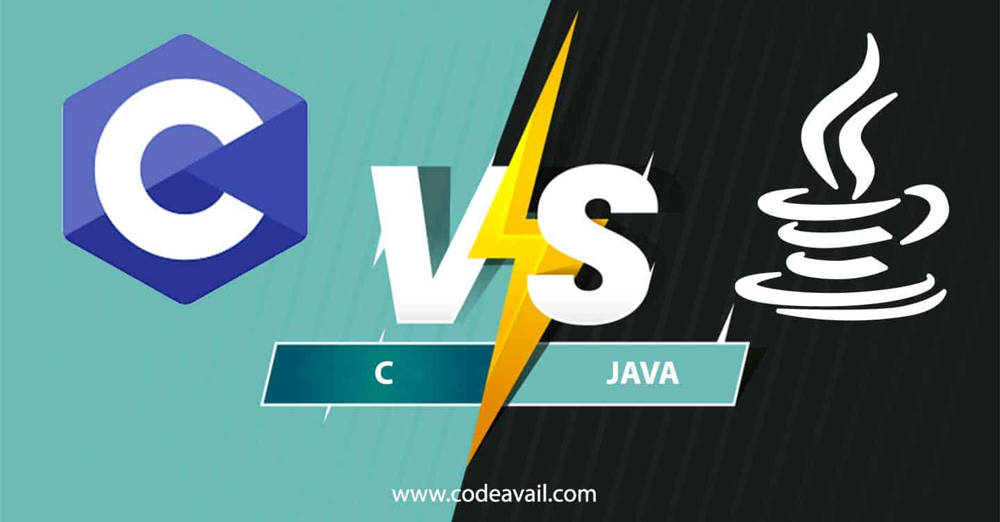

# Multi-Paradigm-Programming-Assignment

  

## How to download the repository:

1. Download the repository from the following link <a href=https://github.com/Roisin-Fallon/Multi-Paradigm-Programming-Assignment>Click here</a>  
2. Click the clone or download button towards the right of your screen
3. Download and unzip this file. Save the unziped file to a location on your desktop where it is easily accessible
4. Open the command line and navigate to the location of your downloaded file using a series of cd commands 

## Running the C Shop

In order to run the Shop program a C compiler is required.
  - Install Cygwin, which gives us a Unix-like environment running on Windows.
  - Install a set of Cygwin packages required for building GCC.
  - From within Cygwin, download the GCC source code, build and install it.
 More details can be found <a href=https://preshing.com/20141108/how-to-install-the-latest-gcc-on-windows/> Click Here </a>
 
 In my case I downloaded Ubuntu 18.04.4 LTS from <a hef=https://ubuntu.com/download/desktop> here</a>
 
 I ran the Shop program by entering the following commands into the  ununtu command line:
 
                   cd /mnt/c                  // As I saved the shop file to the C drive
                   cd c-shop                    // Direct into the shop folder
                   gcc -o c-shop shop.c         
                   gcc shop.c  
                   ./shop.c   
                   ./a.out  

## Running the Java Shop

In order to run the Shop program a Java Compiler is required. 
Instructions on how to install JVM on your machine can be found <a href=https://www.quora.com/How-do-I-install-Java-JVM-on-a-machine> here</a>

Pease note that the source code is located in the /src folder. 

In my case I downloaded the Intelliji Java from <a href=https://www.jetbrains.com/idea/>here</a>

Click File -> Open (find location of where the project is on your computer)
Click Build -> Rebuild Project
Click Run -> Run 'Shop.main()'

## Files that are found in both C and Java folder

  - stock.csv contains the following:
  
     1. Opening Shop Balance
     2. List of items currently stocked in the shop
     3. Price of the products
     4. Quantity of the products currently available
           
  - order.csv contains the following:
  
      1. Name of the customer 
      2. Budget of the customer 
      3. Products the customer wishes to order
      4.  Quantiy the customer wishes to order
            
 ### Extra files to test the functionality
  
   - itemMissing.csv - will show how the program responds if a product the customer wants is not in the shop stck.
   - lackStock.csv - will show how the program responds if a customer orders a product in greater quantity than is present in the shop.
    - budgetShort.csv - will show how the program responds if the customer does not have enough money to pay for the order.
         
## C Shop Folder:

  - shop.c  this contains the code which when run will show the functionality of the C program. 

## Java Shop Folder:
  - shop.java  program should run from this point 

## Report.doc

This word document makes sensible comparasions between the two paradigms (C and Java). It will detail key difference and similarities between the procedural approach (in C) and the object orientated approach (in Java).  

Please find the full project breakdown <a href=https://github.com/Roisin-Fallon/Multi-Paradigm-Programming-Assignment/blob/master/Assignment%201%20-%20Shop.pdf>Here</a>

